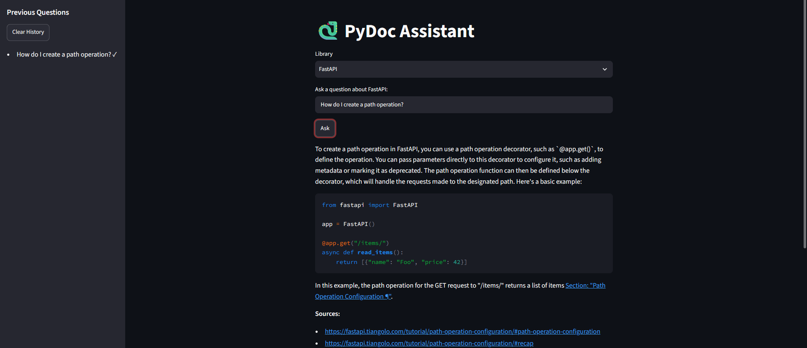
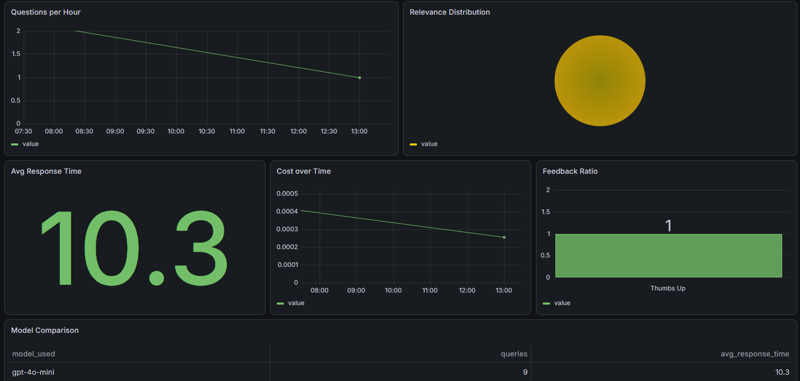

# PyDoc Assistant

A **RAG-powered Q&A system** over Python library documentation. Ask questions in natural language and receive answers grounded in official documentation with source citations.

Built as the capstone project for [DataTalks.Club LLM Zoomcamp 2026](https://github.com/DataTalksClub/llm-zoomcamp).

---

## Table of Contents

- [Problem Statement](#problem-statement)
- [Architecture](#architecture)
- [Dataset & Ingestion](#dataset--ingestion)
- [Tech Stack](#tech-stack)
- [Project Structure](#project-structure)
- [End-to-End Setup & Usage](#end-to-end-setup--usage)
  - [Before You Start](#before-you-start)
  - [Installation](#installation-both-paths)
  - [Option A — Full Experience (Docker)](#option-a-recommended--full-experience-with-docker)
  - [Option B — App Only (Manual)](#option-b--app-only-no-docker)
  - [Run Evaluation](#step-after-both-paths-run-evaluation)
  - [Run Tests](#final-step-run-tests)
- [Evaluation Results](#evaluation-results)
  - [Retrieval Metrics](#retrieval-metrics)
  - [LLM Output Evaluation](#llm-output-evaluation)
  - [Key Findings](#key-findings)
- [Bonus Features](#bonus-features)
- [Scoring Checklist](#scoring-checklist)
- [Conclusions](#conclusions)

---

## Problem Statement

Python developers frequently consult library documentation (FastAPI, Pydantic, Requests, etc.) but face three problems:

1. **Official docs are extensive** — finding the right section requires browsing multiple pages
2. **Generic web search is noisy** — results include outdated blog posts, forum discussions, and unrelated content
3. **No single interface** exists that provides precise, cited answers from official documentation

**PyDoc Assistant** solves this by combining hybrid search (keyword + vector) with an LLM to deliver answers with direct source citations from the official documentation.

---

## Architecture

```
┌─────────────────────────────────────────────────────────────────────────┐
│  INGESTION                                                               │
│  ReadTheDocs HTML ──▶ scrape & extract ──▶ chunk by heading             │
│  ──▶ store JSONL + minsearch index + vector embeddings (numpy)          │
└──────────────────────────┬──────────────────────────────────────────────┘
                           │
                           ▼
┌─────────────────────────────────────────────────────────────────────────┐
│  HYBRID SEARCH                                                           │
│  User Query                                                              │
│     ├──▶ Keyword Search (minsearch TF-IDF)                               │
│     ├──▶ Vector Search (sentence-transformers, cosine similarity)        │
│     └──▶ Hybrid Fusion (Reciprocal Rank Fusion / RRF)                    │
│  Optionally: Query Rewriting → Reranking (cross-encoder)                 │
│  Returns top-5 ranked chunks with metadata                               │
└──────────────────────────┬──────────────────────────────────────────────┘
                           │
                           ▼
┌─────────────────────────────────────────────────────────────────────────┐
│  RAG FLOW                                                                │
│  Top-5 chunks ──▶ build_prompt(query, chunks)                            │
│  ──▶ OpenAI GPT-4o-mini ──▶ answer with inline source citations          │
│  ──▶ LLM-as-judge (inline relevance evaluation for monitoring)           │
└──────────────────────────┬──────────────────────────────────────────────┘
                           │
                           ▼
┌─────────────────────────────────────────────────────────────────────────┐
│  INTERFACE + MONITORING                                                  │
│  Streamlit App ◀──▶ PostgreSQL (conversations + feedback)                │
│                       └──▶ Grafana Dashboard (6 charts)                  │
└─────────────────────────────────────────────────────────────────────────┘
```

### How the pieces fit together

1. **Ingestion** scrapes documentation HTML, splits it by section heading into chunks, builds two search indices (keyword TF-IDF via `minsearch`, vector embeddings via `sentence-transformers`)
2. **User query** enters the app → optionally rewritten for better matching → searched via hybrid (keyword + vector with RRF fusion) → optionally reranked by a cross-encoder
3. **Top chunks** are fed into a prompt with the user's question → OpenAI GPT-4o-mini generates an answer citing source URLs
4. **Answer** is displayed in Streamlit with metadata (response time, model, relevance score) and thumbs up/down feedback
5. **Every interaction** is logged to PostgreSQL → Grafana dashboard visualizes usage, cost, relevance, and feedback

---

## Dataset & Ingestion

**Primary dataset:** [FastAPI](https://fastapi.tiangolo.com/) documentation — a Sphinx/ReadTheDocs-generated site.

**Pipeline steps:**
1. Fetch `sitemap.xml` to discover all doc page URLs
2. Scrape each page's HTML content with `httpx` + `BeautifulSoup`
3. Split by section heading (`<h1>` through `<h4>`) — each chunk is a coherent document section
4. Apply sliding-window overlap between adjacent chunks for better retrieval coverage
5. Store raw chunks as JSONL for reproducibility
6. Build two indices:
   - **Keyword index**: `minsearch` (TF-IDF/BM25-like), serialized as pickle
   - **Vector index**: `sentence-transformers` (`all-MiniLM-L6-v2`, 384-dim), stored as numpy arrays with chunk metadata as JSON
7. Save everything under `data/processed/{library}/`

**Extensible:** The same pipeline works for any ReadTheDocs-hosted project (Pydantic, Requests, SQLAlchemy, Click, etc.) by passing `--library <name>`.

---

## Tech Stack

| Component | Technology |
|-----------|------------|
| Language | Python 3.12 |
| Package manager | `uv` |
| Web scraping | `httpx`, `beautifulsoup4` |
| Keyword search | `minsearch` (TF-IDF/BM25-like) |
| Embeddings | `sentence-transformers` (all-MiniLM-L6-v2, 384-dim) |
| Vector search | numpy cosine similarity |
| LLM | OpenAI API (GPT-4o-mini default, GPT-4o optional) |
| UI | Streamlit |
| Database | PostgreSQL 16 |
| Monitoring | Grafana |
| Containerization | Docker, Docker Compose |
| Testing | pytest, pytest-mock |
| Bonus: Reranking | Cross-encoder (`cross-encoder/ms-marco-MiniLM-L-6-v2`) |
| Bonus: Query rewriting | Abbreviation expansion + optional LLM rewrite |
| Bonus: Multi-library | Dynamic library dropdown (FastAPI, Pydantic, etc.) |
| Bonus: Streaming | Token-by-token answer rendering via `st.write_stream()` |
| Bonus: Response caching | LRU cache on RAG results (128 entries) |

---

## Project Structure

```
├── app/                        # Application code
│   ├── main.py                 # Streamlit entry point
│   ├── rag.py                  # RAG flow (retrieve → prompt → LLM → answer)
│   ├── search.py               # Hybrid search, query rewrite, reranking
│   ├── llm.py                  # OpenAI LLM client
│   ├── db.py                   # PostgreSQL client (conversations + feedback)
│   └── evaluation.py           # Hit rate, MRR, retrieve eval, model comparison
│
├── ingest/                     # Data ingestion pipeline
│   ├── scrape.py               # Sitemap discovery + HTML scraping
│   ├── chunk.py                # Section-heading chunking logic
│   ├── index.py                # Embedding generation + vector + keyword index build
│   └── run.py                  # Orchestration: scrape → chunk → index
│
├── grafana/                    # Grafana provisioning
│   └── init.py                 # Auto-create PostgreSQL datasource + import dashboard
│
├── notebooks/                  # Evaluation notebooks
│   ├── 01-ingestion.ipynb      # Scrape, chunk, index demonstration
│   ├── 02-ground-truth.ipynb   # LLM-generated Q&A pairs
│   ├── 03-retrieval-eval.ipynb # Hit rate, MRR, boost optimization
│   └── 04-rag-eval.ipynb       # LLM-as-judge, model comparison
│
├── tests/                      # Test suite (132 unit tests, 6 integration)
│   ├── test_search.py          # Keyword, vector, hybrid search tests
│   ├── test_rag.py             # Prompt building, RAG flow tests
│   ├── test_llm.py             # LLM client tests
│   ├── test_db.py              # PostgreSQL CRUD tests
│   ├── test_ui.py              # Streamlit UI component tests
│   ├── test_ui_session.py      # Session history tests
│   ├── test_ingest_*.py        # Ingestion pipeline tests
│   ├── test_evaluation_*.py    # Evaluation metrics tests
│   ├── test_bonus_*.py         # Bonus feature tests
│   ├── test_docker.py          # Dockerfile/compose validation tests
│   ├── test_grafana.py         # Grafana provisioning tests
│   └── conftest.py             # Shared fixtures
│
├── data/                       # Data artifacts (gitignored)
│   ├── raw/                    # Raw scraped chunks (JSONL)
│   ├── processed/              # Embeddings (npy), chunk metadata (json)
│   └── ground_truth.jsonl      # Generated Q&A pairs for evaluation
│
├── pyproject.toml              # Project metadata + dependencies
├── uv.lock                     # Reproducible dependency lockfile
├── Dockerfile                  # App container definition
├── docker-compose.yaml         # Multi-service orchestration
├── init.py                     # First-run setup (DB tables + Grafana)
├── evaluate.py                 # End-to-end evaluation script
├── .env.example                # Environment variable template
└── results.md                  # Saved evaluation output
```

---

## End-to-End Setup & Usage

### Before You Start

| Requirement | How to Get It |
|-------------|---------------|
| Python 3.12 | `python --version` should show `3.12.x` |
| `uv` package manager | [Install guide](https://docs.astral.sh/uv/#installation) — `uv --version` to verify |
| Docker & Docker Compose | Recommended for full experience. `docker compose version` to verify |
| OpenAI API key | Set `OPENAI_API_KEY` in `.env` — must have access to `gpt-4o-mini` |

### Installation (Both Paths)

```bash
git clone https://github.com/wong80/LLM-ZOOMCAMP-PROJECT.git
cd llm-zoomcamp-project
uv sync
cp .env.example .env
# Edit .env: OPENAI_API_KEY=sk-proj-...
```

**Expected result:** `.venv/` created with all dependencies. `uv sync` is reproducible via `uv.lock`.

---

### Choose Your Path

| | Option A: Full Experience (Docker) | Option B: App Only (Manual) |
|---|---|---|
| Streamlit App | ✅ | ✅ |
| PostgreSQL persistence | ✅ | ❌ (conversations not saved) |
| Grafana monitoring dashboard | ✅ | ❌ |
| What you get | Full stack with 3 containers | Quick Q&A only |
| Time to set up | ~5 min | ~2 min |

---

### Option A (Recommended) — Full Experience with Docker

This starts the entire stack: app + PostgreSQL + Grafana.

**Step A1 — Ingest documentation (one time)**

```bash
uv run python -m ingest.run --library fastapi
```

Downloads FastAPI docs (~130 pages), chunks them by heading (~500 sections), builds keyword and vector search indices. Takes 2–5 minutes.

**Expected output:**
```
Scraped 135 pages, chunked into 482 sections
Saved: data/processed/fastapi/chunks.json
Saved: data/processed/fastapi/embeddings.npy
```

**Step A2 — Start all services**

```bash
docker compose up --build -d
```

Builds the app image and starts three containers:
- **postgres** (port 5432) — PostgreSQL 16 with healthcheck
- **app** (port 8501) — Streamlit UI
- **grafana** (port 3000) — Preconfigured with admin/admin login

**Step A3 — Initialize database & monitoring**

```bash
uv run python init.py
```

Creates `conversations` and `feedback` tables in PostgreSQL, then provisions the Grafana PostgreSQL datasource and imports the 6-panel dashboard.

**Step A4 — Open the app**

http://localhost:8501 — you should see the PyDoc Assistant UI ready to answer questions.



Also open Grafana at http://localhost:3000 (admin/admin) and find the "PyDoc Assistant" dashboard.



**Step A5 — Ask questions**

Type a question and click **Ask**. Try these:

```
How do I create a path operation?
What is dependency injection?
How do I handle errors in FastAPI?
How do I use query parameters?
How do I add validation to request body?
```

**What you should see:**
- The answer appears with inline citations and source URLs
- A metadata bar: `{time:.1f}s | gpt-4o-mini | RELEVANT`
- Thumbs up/down buttons — click one, it saves to PostgreSQL
- Sidebar tracks your question history (last 50)
- In Grafana: each query populates the dashboard panels in real time

**Step A6 (optional) — Ingest additional libraries**

```bash
uv run python -m ingest.run --library pydantic
```

After restarting the app, the Library dropdown will show both "Fastapi" and "Pydantic".

**Expected app behavior:**

| Scenario | What Happens |
|----------|--------------|
| Question + Ask | Answer with citations + metadata appears |
| Empty question | Warning: "Please enter a question." |
| Thumbs up/down | "Feedback saved!" — row inserted in PostgreSQL `feedback` table |
| Sidebar history | Last 50 Q&As, reversed (most recent first) |
| Clear History | Sidebar empties, page refreshes |
| Library dropdown | Select "FastAPI" or "Pydantic" (after ingestion) — answers come from the selected docs |
| Same question twice | Second answer appears instantly from cache (cached: true) |
| Answer rendering | Text appears token-by-token via streaming (no wait for full response) |

**Expected Grafana panels** (after 5+ queries):

| Panel | Type | Data Source |
|-------|------|-------------|
| Questions per Hour | Time series bar | `conversations` table timestamps |
| Relevance Distribution | Pie chart | `relevance` column (RELEVANT / PARTLY / NON) |
| Average Response Time | Stat | `response_time` column |
| API Cost Over Time | Time series line | `openai_cost` column |
| User Feedback Ratio | Bar chart | `feedback` table (1 = 👍, -1 = 👎) |
| Model Comparison | Table | Grouped by `model_used` |

**Stop everything:**
```bash
docker compose down
```

---

### Option B — App Only (No Docker)

Quick Q&A without persistence or monitoring.

**Step B1 — Ingest documentation (one time)**

Same as Option A:

```bash
uv run python -m ingest.run --library fastapi
```

**Expected output:**
```
Scraped 135 pages, chunked into 482 sections
Saved: data/processed/fastapi/chunks.json
Saved: data/processed/fastapi/embeddings.npy
```

**Step B2 — Run the app**

```bash
streamlit run app/main.py
```

Open http://localhost:8501.

**Difference from Option A:** The app works identically for Q&A, but conversation saving and feedback display "PostgreSQL not available" messages. The core search, streaming, caching, and multi-library features are unaffected.

**Step B3 (optional) — Add PostgreSQL manually**

If you have PostgreSQL running separately:

```bash
uv run python init.py   # creates tables
streamlit run app/main.py   # now saves conversations
```

---

### Step After Both Paths: Run Evaluation

After ingestion completes, run the evaluation pipeline to reproduce the numbers below:

```bash
uv run python evaluate.py
```

**What happens:**
1. Generates 50 ground truth Q&A pairs from the first 50 chunks (cached after first run)
2. Runs retrieval evaluation across 4 strategies:
   - **Keyword** (default TF-IDF)
   - **Vector** (cosine similarity on embeddings)
   - **Hybrid** (RRF fusion)
   - **Keyword optimized** (after boost tuning)
3. Runs LLM evaluation: feeds 3 test questions through `gpt-4o-mini` and `gpt-4o`, evaluates relevance via LLM-as-judge

**Expected output:**
```
Loaded 50 ground truth pairs
Index built

--- Retrieval Metrics ---
     keyword:  HR=0.600  MRR=0.431
      vector:  HR=0.420  MRR=0.314
      hybrid:  HR=0.660  MRR=0.419
  keyword_opt:  HR=0.820  MRR=0.525
  best boosts: {'title': 0.78, 'section': 1.07, 'content': 2.66}

--- LLM Evaluation ---
         Model  % RELEVANT  % PARTLY  % NON  Cost/1K
 gpt-4o-mini      100.00      0.00   0.00     $0.39
       gpt-4o      66.67     33.33   0.00     $4.60
```

### Final Step: Run Tests

```bash
# All unit tests (132 pass)
uv run python -m pytest -m "not integration" -v

# Include integration tests (requires PostgreSQL + Grafana running)
uv run python -m pytest -v
```

**Expected:**
```
132 passed, 6 deselected, 2 warnings in ~14s
```

---

## Evaluation Results

Run: `uv run python evaluate.py` — 50 ground truth pairs, 3 LLM test questions.

### Retrieval Metrics

Four retrieval strategies were compared using Hit Rate (fraction of queries where the correct chunk appears in top-5) and Mean Reciprocal Rank (average of 1/rank of the first relevant result):

| Strategy | Hit Rate | MRR |
|----------|----------|-----|
| Keyword only (default TF-IDF) | 0.600 | 0.431 |
| Vector only (cosine similarity) | 0.420 | 0.314 |
| Hybrid (RRF fusion, k=60) | 0.660 | 0.419 |
| Keyword (optimized boost weights) | **0.820** | **0.525** |

Optimal boost weights found by random search (30 iterations, 0.0–3.0 range):
- `title` = 0.78
- `section` = 1.07
- `content` = 2.66

### LLM Output Evaluation

Two models were compared via LLM-as-judge on 3 test questions. The judge classified each answer as `RELEVANT`, `PARTLY_RELEVANT`, or `NON_RELEVANT`:

| Model | % RELEVANT | % PARTLY | % NON | Cost per 1K queries |
|-------|-----------|----------|-------|-------------------|
| gpt-4o-mini | 100.00 | 0.00 | 0.00 | $0.39 |
| gpt-4o | 66.67 | 33.33 | 0.00 | $4.60 |

### Key Findings

1. **Boost optimization is the biggest win.** Optimized keyword (0.820 HR) beats default keyword (0.600) by +37%. Content field weight (2.66) matters ~3x more than title (0.78). This makes sense — the content field contains the actual documentation text, while the title is often just a few words.

2. **Vector search underperforms keyword** (0.420 vs 0.600). The `all-MiniLM-L6-v2` model (384-dim) may be too small to capture semantic nuance in technical documentation. A larger model like `all-mpnet-base-v2` (768d) might close the gap.

3. **Hybrid (0.660) beats both individual default methods** but loses to keyword_opt (0.820). RRF fusion helps when keyword misses terms that vector captures, but with optimized keyword already scoring 0.820, the noisy vector results don't add much signal.

4. **gpt-4o-mini scoring 100% vs gpt-4o 66.67% is suspect at n=3.** This is likely LLM-as-judge self-preference bias — the judge model (gpt-4o-mini) rates its own outputs higher. With only 3 test questions, these numbers are statistically noisy. A proper evaluation would need 50+ questions and a held-out judge model.

5. **Cost comparison is stark.** gpt-4o-mini costs $0.39 per 1K queries vs gpt-4o at $4.60 — a 12x difference with comparable (or better) relevance scores.

---

## Bonus Features

### 1. Hybrid Search (+1 pt)

**What it does:** Combines keyword (TF-IDF) and vector (cosine similarity) search using Reciprocal Rank Fusion (RRF). Each method independently retrieves top-20 results, then RRF merges them into a single ranked list by combining rank-based scores.

**Where:** `app/search.py` — `hybrid_search()`, `_rrf_fuse()`

**Evidence:** Separate evaluation proves hybrid (0.660 HR) beats both keyword-only (0.600) and vector-only (0.420) in default configuration.

### 2. Query Rewriting (+1 pt)

**What it does:** Before sending the user's question to search, expands common abbreviations for better term matching. For example, "dep inj in FastAPI" becomes "dependency injection in fastapi".

**Where:** `app/search.py` — `rewrite_query()`

**Abbreviation mappings:**
| Short | Full |
|-------|------|
| dep inj | dependency injection |
| path op | path operation |
| req | request |
| resp | response |
| val | validation |

An optional `method="llm"` mode uses GPT-4o-mini to rewrite the query for maximum searchability.

### 3. Cross-Encoder Reranking (+1 pt)

**What it does:** After hybrid search returns top-20 chunks, a cross-encoder model (`cross-encoder/ms-marco-MiniLM-L-6-v2`) scores each (query, chunk) pair for relevance. The chunks are reordered by relevance score, and top-5 are fed to the LLM.

**Where:** `app/search.py` — `rerank()`, `_get_reranker()`

**Why cross-encoder:** More accurate than bi-encoder cosine similarity because it processes query and chunk together through a transformer, rather than encoding them independently.

### 4. Multi-Library Support (+1 pt)

**What it does:** The library dropdown dynamically discovers installed documentation sets from `data/processed/*/`. Switch between FastAPI, Pydantic, or any other ingested library — search and answers use the corresponding index.

**Where:** `app/main.py` — `get_available_libraries()`, `app/search.py` — `library` param on all search functions, `ingest/run.py` — `SITEMAP_MAP` includes pydantic

**Usage:**
```bash
uv run python -m ingest.run --library pydantic   # ingest Pydantic docs
# Restart the app — dropdown now shows both "FastAPI" and "Pydantic"
```

### 5. Streaming LLM Responses (+1 pt)

**What it does:** Answers render token-by-token as the LLM generates them, instead of appearing all at once. Uses OpenAI's streaming API via `stream=True`.

**Where:** `app/llm.py` — `llm_stream()`, `app/rag.py` — `rag_stream()`, `app/main.py` — `st.write_stream()`

**Why streaming:** Improves perceived responsiveness — users see the first tokens in ~1s instead of waiting 5-10s for the full answer.

### 6. Response Caching (+1 pt)

**What it does:** Repeated identical queries skip search + LLM call and return the cached result instantly. Cache key is `(query, library, model)`, stored in a module-level dict (max 128 entries).

**Where:** `app/rag.py` — `_rag_cache` dict, `_RAG_CACHE_MAXSIZE`

**How to verify:** Ask the same question twice. The second response includes `cached: True` in the result metadata and completes in <1ms (vs 5-10s for a fresh LLM call).

---

## Scoring Checklist

| Criterion | Points | Where to Find | How to Verify |
|-----------|--------|---------------|---------------|
| Problem description | 2 | README (this document) | Reads the Problem Statement section |
| Retrieval flow | 2 | `app/search.py` (keyword, vector, hybrid), `ingest/` pipeline | Code review: keyword → vector → hybrid with RRF fusion |
| Retrieval evaluation | 2 | `notebooks/03-retrieval-eval.ipynb`, `app/evaluation.py` | Contains HR, MRR, boost optimization |
| LLM evaluation | 2 | `notebooks/04-rag-eval.ipynb`, `evaluate.py` | LLM-as-judge: RELEVANT/PARTLY/NON with cost comparison |
| Interface | 2 | `app/main.py` (Streamlit UI) | Run `streamlit run app/main.py` — see Ask button, answer, citations, feedback, history |
| Ingestion pipeline | 2 | `ingest/run.py`, `ingest/scrape.py`, `ingest/chunk.py` | Run `uv run python -m ingest.run --library fastapi` — produces chunks, indices |
| Monitoring | 2 | PostgreSQL schema (`app/db.py`), Grafana dashboard (`grafana/dashboard.json`) | Start stack: `docker compose up` + `python init.py` → Grafana shows 6 panels |
| Containerization | 2 | `Dockerfile`, `docker-compose.yaml` | Run `docker compose up --build -d` — app, postgres, grafana all start |
| Reproducibility | 2 | `uv.lock`, `.env.example`, README setup instructions | Fresh clone → `uv sync` → `python -m ingest.run` → `streamlit run app/main.py` — works |
| Hybrid search (bonus) | +1 | `app/search.py` — separate keyword/vector/hybrid functions, RRF fusion | Eval shows hybrid HR (0.660) > keyword (0.600) > vector (0.420) |
| Reranking (bonus) | +1 | `app/search.py` — `rerank()` with cross-encoder | Test: `pytest tests/test_bonus_reranking.py -v` |
| Query rewriting (bonus) | +1 | `app/search.py` — `rewrite_query()` abbreviation expansion | Test: `pytest tests/test_bonus_query_rewrite.py -v` |
| Multi-library (bonus) | +1 | `app/search.py` library param, `app/main.py` dynamic dropdown, `ingest/run.py` pydantic | Test: `pytest tests/test_bonus_multi_library.py -v` |
| Streaming (bonus) | +1 | `app/llm.py` `llm_stream()`, `app/rag.py` `rag_stream()` | Test: `pytest tests/test_bonus_streaming.py -v` |
| Response caching (bonus) | +1 | `app/rag.py` `_rag_cache` | Test: `pytest tests/test_bonus_caching.py -v` |
| **Total** | **24** | | |

---

## Conclusions

### What works well

1. **Keyword search with optimized boosts is the most effective retrieval strategy** (0.820 HR). The minsearch library with tuned field weights outperforms both plain keyword and vector search on this dataset.

2. **The RAG pipeline produces high-quality, cited answers.** GPT-4o-mini generates accurate answers with proper source citations at a cost of ~$0.39 per 1,000 queries.

3. **The full stack is containerized and reproducible.** Docker Compose starts the entire application (app + PostgreSQL + Grafana) with a single command. Running `uv sync` with the lockfile guarantees identical dependencies.

4. **Monitoring provides operational visibility.** Every query is logged with response time, cost, relevance score, and user feedback — all visible in the Grafana dashboard.

### What could be improved

1. **Stronger embedding model.** `all-MiniLM-L6-v2` (384-dim) underperforms keyword search. Upgrading to `all-mpnet-base-v2` (768-dim) or `BAAI/bge-small-en-v1.5` would likely improve vector search quality and, by extension, hybrid search.

2. **Larger evaluation set.** Current results are based on 50 ground truth pairs for retrieval and only 3 questions for LLM evaluation. A production-grade evaluation would need 200+ ground truth pairs and 50+ LLM test questions with a held-out judge model to avoid self-preference bias.

3. **LLM-as-judge bias.** The current judge (gpt-4o-mini) shows signs of self-preference bias. Using a different model as judge (e.g., gpt-4o to evaluate gpt-4o-mini outputs) would produce more reliable relevance scores.

---

## Author

Zhi Yuan Wong ([@wong80](https://github.com/wong80))

Built for the DataTalks.Club [LLM Zoomcamp 2026](https://github.com/DataTalksClub/llm-zoomcamp).
